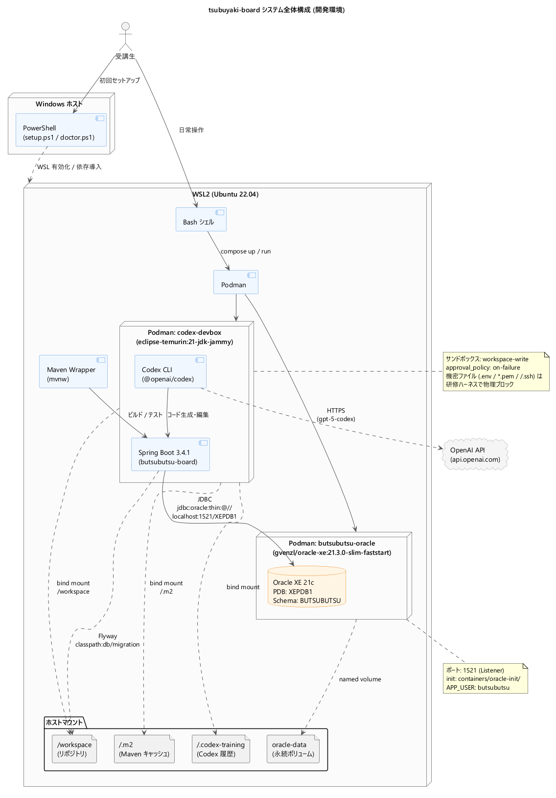
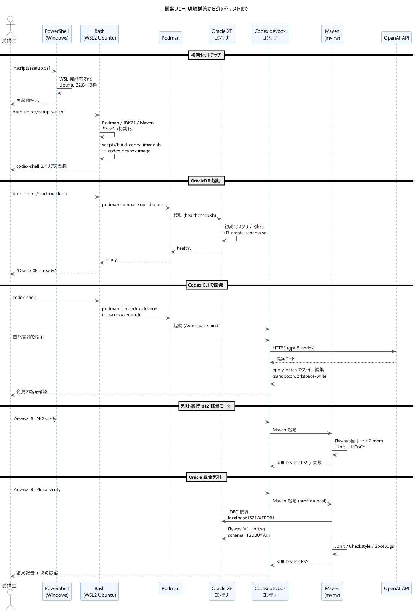
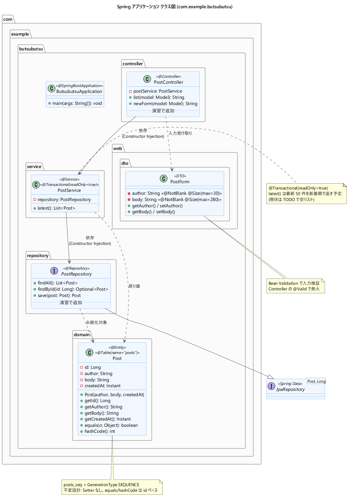
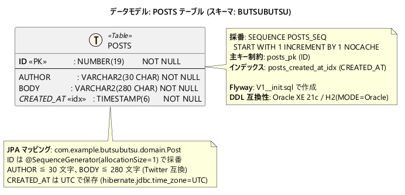

# tsubuyaki-board アーキテクチャ設計書

> **対象読者**: 本リポジトリで研修を受ける受講生・講師、および新規参画する開発メンバー。
> **目的**: AI 駆動開発研修テンプレートとしての全体構成（開発環境・コンテナ・AI ツール連携）と、Spring Boot アプリケーション「tsubuyaki-board（社内つぶやきボード）」の基本設計を 1 ページで俯瞰すること。

---

## 1. 概要

### プロジェクト位置付け

- **プロダクト名**: tsubuyaki-board（社内つぶやきボード）
- **性質**: AI 駆動開発研修テンプレート。Codex CLI（OpenAI）を講師として、TDD で短文投稿掲示板を Spring Boot で実装する 3 日間の演習素材。
- **ドメイン**: 投稿者名・本文（最大 280 文字）・作成日時を持つ短文投稿（Twitter 互換の文字数制限）の一覧表示・投稿。

### 技術スタック

| レイヤ | 採用技術 |
| --- | --- |
| 言語 / ランタイム | Java 21 (OpenJDK / Eclipse Temurin) |
| アプリ FW | Spring Boot 3.4.1 (Web / Thymeleaf / Data JPA / Validation / Actuator) |
| DB マイグレーション | Flyway Core + flyway-database-oracle |
| 本番系 DB | Oracle XE 21c（Podman: `gvenzl/oracle-xe:21.3.0-slim-faststart`） |
| テスト系 DB | H2（`MODE=Oracle`、メモリモード） |
| ビルド | Maven Wrapper (`mvnw`) |
| 静的解析 | Checkstyle 10.18 / SpotBugs 4.8 / JaCoCo 0.8.12 |
| AI コーディング | Codex CLI (`gpt-5-codex`, MIT / OpenAI 製) |
| コンテナ | Podman + `compose.yaml` |
| 開発 OS | Windows 11 + WSL2 (Ubuntu 22.04) |

---

## 2. システム全体構成



受講生は Windows ホストの PowerShell で初回セットアップを行い、以降の日常作業は WSL2 上の Bash で完結する。アプリ実行とコード生成は 2 つの Podman コンテナに分離されている。

| コンポーネント | 役割 | ホスト境界 |
| --- | --- | --- |
| **PowerShell** (`scripts/setup.ps1`, `doctor.ps1`) | WSL 機能の有効化、Ubuntu 22.04 の導入、Windows 側の依存検査 | Windows ホスト |
| **WSL2 Ubuntu** (`scripts/setup-wsl.sh`, `doctor.sh`) | Podman・JDK21・Maven キャッシュの初期化、`codex-shell` エイリアスの登録 | WSL2 |
| **`tsubuyaki-oracle`** コンテナ | Oracle XE 21c の本番系 DB。ポート `1521` を WSL に publish | Podman |
| **`codex-devbox`** コンテナ | Codex CLI と Spring Boot ビルド環境（Temurin 21 JDK + Node 20 + Maven 3.9 + GitHub CLI） | Podman |
| **OpenAI API** (`api.openai.com`) | Codex CLI の対話先。モデルは `gpt-5-codex` | 外部クラウド |

### ホストマウントとボリューム

| マウント | 用途 |
| --- | --- |
| `/workspace` ← リポジトリ | コード生成・編集対象（`codex-devbox` で書き込み可） |
| `~/.m2` ← Maven キャッシュ | コンテナ再起動を跨いだ依存キャッシュの保持 |
| `~/.codex-training/tsubuyaki-board` ← Codex 履歴 | 受講生ホームから隔離した研修専用 `CODEX_HOME` |
| `oracle-data`（named volume）| Oracle のデータファイル永続化 |

### セキュリティ境界

- Codex CLI のサンドボックスは `workspace-write`、`approval_policy` は `on-failure`（`.codex/config.toml`）。
- `ORACLE_PWD` / `ORACLE_APP_PWD` などの機密値は `[shell_environment_policy].include_only` から意図的に除外され Codex に渡らない。
- 機密ファイル（`.env*` / `*.pem` / `~/.ssh` / `~/.bashrc` 等）の読取、破壊的 Git 操作（`reset --hard` / `push --force` / 共有 `main` への push など。push 先は自分の `<github-id>` ブランチのみ）、`sudo`、リモートコード実行（`curl URL | bash`）は研修ハーネスで物理ブロック。

---

## 3. 開発環境セットアップと実行フロー



### セットアップ手順（初回のみ）

```powershell
# Windows: 管理者 PowerShell
.\scripts\setup.ps1
```

```bash
# WSL2 (Ubuntu) で初回起動後
bash scripts/setup-wsl.sh
bash scripts/build-codex-image.sh   # codex-devbox イメージビルド
```

### 日常の開発サイクル

```bash
# 1. Oracle XE 起動（コンテナ常駐）
bash scripts/start-oracle.sh
# → healthcheck で "Oracle XE is ready." を待機

# 2. Codex CLI コンテナへ入る
codex-shell           # = bash /mnt/c/workspace/<repo>/scripts/run-codex.sh

# 3. テスト先行（軽量モード: H2）
./mvnw -B -Ph2 verify

# 4. Oracle 統合テスト（Flyway → JPA validate → Oracle XE）
./mvnw -B -Plocal verify

# 5. アプリ起動して動作確認
./mvnw -Plocal spring-boot:run
# http://localhost:8080/  → posts/list
```

### Spring プロファイル切替

| プロファイル | 接続先 | 用途 | Maven 起動例 |
| --- | --- | --- | --- |
| `local`（既定） | Oracle XE on Podman | 本番系 DB と同じ DDL/方言で検証 | `./mvnw -Plocal verify` |
| `h2` | H2 in-memory（`MODE=Oracle`）| CI / 軽量ローカル。Flyway 適用後 `ddl-auto: none` | `./mvnw -Ph2 verify` |

---

## 4. Spring アプリケーション基本設計



### パッケージ構成

```
com.example.tsubuyaki
├── TsubuyakiApplication       … エントリーポイント (@SpringBootApplication)
├── controller/
│   └── PostController         … Thymeleaf 画面の MVC コントローラ
├── service/
│   └── PostService            … 業務ロジック (@Transactional readOnly)
├── repository/
│   └── PostRepository         … JpaRepository<Post, Long>
├── domain/
│   └── Post                   … JPA エンティティ（不変設計）
└── web/dto/
    └── PostForm               … 入力フォーム DTO + Bean Validation
```

依存方向は **Controller → Service → Repository → Entity** の一方向、すべて Constructor Injection。`PostController` のみ DTO `PostForm` を受け取り、Service 層には Entity だけが流れる。

### 各クラスの責務

| クラス | ステレオタイプ | 主な責務 |
| --- | --- | --- |
| `PostController` | `@Controller` | `GET /`・`GET /posts` で一覧、`GET /posts/new` で投稿フォームを返却。`POST /posts`（登録）と `GET /posts/{id}`（詳細）は演習で受講生が追加 |
| `PostService` | `@Service` `@Transactional(readOnly=true)` | `latest()` で最新投稿リストを取得。現状は TODO の空リスト返却で、演習中に `findTop50ByOrderByCreatedAtDesc()` 連携を実装 |
| `PostRepository` | （`@Repository`相当）| `JpaRepository<Post, Long>` を継承。追加クエリは演習で導出メソッドとして追加 |
| `Post` | `@Entity` `@Table(name="posts")` | `posts_seq` を使った Sequence 採番、Setter なしの不変設計、`equals/hashCode` は `id` ベース |
| `PostForm` | DTO | `@NotBlank` + `@Size(max=30)` の `author`、`@NotBlank` + `@Size(max=280)` の `body` を Bean Validation で検査 |

### Web 層（Thymeleaf）

サーバーサイドレンダリング。`src/main/resources/templates/posts/` 配下に `list.html`・`form.html`、`static/css/app.css` で軽量にスタイリング。SPA や JS フレームワークは未採用。

---

## 5. データモデル



### `POSTS` テーブル（スキーマ: `TSUBUYAKI`）

| カラム | 型 | 制約 / 備考 |
| --- | --- | --- |
| `ID` | `NUMBER(19)` | PK（`posts_pk`）、`POSTS_SEQ` で採番 |
| `AUTHOR` | `VARCHAR2(30 CHAR)` | NOT NULL |
| `BODY` | `VARCHAR2(280 CHAR)` | NOT NULL（Twitter 互換の上限） |
| `CREATED_AT` | `TIMESTAMP(6)` | NOT NULL、UTC 保存（`hibernate.jdbc.time_zone=UTC`） |

- **シーケンス**: `POSTS_SEQ` (`START WITH 1 INCREMENT BY 1 NOCACHE`)
- **インデックス**: `POSTS_CREATED_AT_IDX` (`CREATED_AT`) — 新着順取得を高速化
- **マイグレーション管理**: `src/main/resources/db/migration/V1__init.sql`（Flyway）
- **DDL 互換性**: Oracle XE 21c と H2 (`MODE=Oracle`) の双方で同一 DDL が通る

スキーマ作成権限（`CREATE SEQUENCE` / `PROCEDURE` / `VIEW` / `SYNONYM`）は `containers/oracle-init/01_create_schema.sql` で Oracle コンテナ起動時に付与される。

---

## 6. 設定ファイルとプロファイル

| ファイル | 役割 | 主な内容 |
| --- | --- | --- |
| `application.yml` | 共通設定 | アプリ名、Flyway 有効化、`open-in-view: false`、JPA UTC、Actuator `health,info`、`server.port: 8080`、`com.example.tsubuyaki` を `DEBUG` |
| `application-local.yml` | Oracle 接続 | `jdbc:oracle:thin:@//localhost:1521/XEPDB1`、`OracleDialect`、`ddl-auto: validate`、Flyway スキーマ `TSUBUYAKI` |
| `application-h2.yml` | H2 接続 | `jdbc:h2:mem:tsubuyaki;MODE=Oracle;DATABASE_TO_UPPER=true`、`H2Dialect`、`ddl-auto: none`（Flyway 一任） |

`spring.profiles.default: local` のため、引数なしの `mvnw spring-boot:run` は Oracle に接続する。

---

## 7. ビルド・品質ゲート

### Maven プロファイル

| プロファイル | 効果 |
| --- | --- |
| `local`（既定） | `spring.profiles.active=local`（Oracle 接続） |
| `h2` | `spring.profiles.active=h2`（H2 接続） |
| `coverage-day1` | JaCoCo `LINE COVEREDRATIO` 下限を `0.60` に設定 |
| `coverage-day2` | 同 `0.70` |
| `coverage-day3` | 同 `0.80` |
| `strict` | Checkstyle / SpotBugs / JaCoCo を `fail-on-violation` 化（評価フェーズ用） |

### 品質チェック構成

- **Checkstyle**: `config/checkstyle.xml`（`verify` フェーズで `check` 実行）
- **SpotBugs**: `effort=Max`、`threshold=Default`、`config/spotbugs-exclude.xml` で除外
- **JaCoCo**: `prepare-agent` → `report` → `check`、閾値はプロファイルで段階制御

### テスト構成

`src/test/java/com/example/tsubuyaki/sample/` に **サンプル TDD 雛形** が配置されている（**削除禁止**）。

| サンプル | テスト手法 | 対象 |
| --- | --- | --- |
| `SamplePostControllerTest` | `@WebMvcTest` + MockMvc | Web レイヤスライス |
| `SamplePostServiceTest` | `@ExtendWith(MockitoExtension)` + Mockito | サービス単体 |
| `SamplePostRepositoryTest` | `@DataJpaTest` + H2 in-memory | リポジトリ統合 |

受講生はこれらを参考に各自のテストを追加し、Day1 → Day3 で 60% → 70% → 80% のカバレッジ閾値を満たす。

---

## 8. 図の再生成方法

設計図はすべて PlantUML ソース（`docs/diagrams/*.puml`）が真実で、PNG は再生成可能な成果物。`tools/plantuml.jar` は `.gitignore` 配下に置く（リポジトリには含めない）。

### PlantUML jar の取得

```powershell
# PowerShell（リポジトリルートで）
$latest = Invoke-RestMethod -Uri "https://api.github.com/repos/plantuml/plantuml/releases/latest" -Headers @{ 'User-Agent' = 'tsubuyaki-board-setup' }
$asset = $latest.assets | Where-Object { $_.name -eq "plantuml-mit-$($latest.tag_name.TrimStart('v')).jar" } | Select-Object -First 1
New-Item -ItemType Directory -Force tools | Out-Null
Invoke-WebRequest -Uri $asset.browser_download_url -OutFile "tools\plantuml.jar" -UseBasicParsing
```

### PNG 一括再生成

```bash
# WSL2 / Windows どちらでも可（Java 17+ が必要）
java -jar tools/plantuml.jar -tpng -charset UTF-8 \
  docs/diagrams/system-overview.puml \
  docs/diagrams/dev-flow.puml \
  docs/diagrams/spring-class.puml \
  docs/diagrams/er-posts.puml
```

### 図ソースを編集したい場合

1. `docs/diagrams/*.puml` を編集（VS Code の PlantUML 拡張で随時プレビュー可）
2. 上記コマンドで PNG を再生成
3. 設計書のレビューと合わせてコミット

---

## 付録: 参照ファイル一覧

| カテゴリ | パス |
| --- | --- |
| アプリ本体 | `src/main/java/com/example/tsubuyaki/**` |
| Spring 設定 | `src/main/resources/application*.yml` |
| Flyway DDL | `src/main/resources/db/migration/V1__init.sql` |
| Thymeleaf テンプレ | `src/main/resources/templates/posts/*.html` |
| Maven 定義 | `pom.xml` |
| Oracle コンテナ | `compose.yaml`、`containers/oracle-init/01_create_schema.sql` |
| Codex devbox | `containers/codex-devbox/` |
| Codex CLI 設定 | `.codex/config.toml`、`.codex/instructions.md`、`.codex/prompts/` |
| セットアップ | `scripts/setup.ps1`、`scripts/setup-wsl.sh`、`scripts/start-oracle.sh`、`scripts/run-codex.sh`、`scripts/doctor.*` |
| 受講生ガイド | `AGENTS.md`、`README.md`、`education/` |
