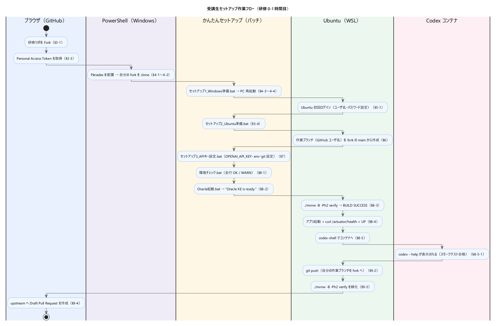

# 受講生向けセットアップガイド

AI 駆動開発研修 3 日コースで使う「社内つぶやきボード」演習リポジトリの初期セットアップ手順です。
**研修 0-1 時間目で「アプリが空起動できる状態」にする**ことがゴール。

詳細な進め方は [ONBOARDING.md](./ONBOARDING.md) を、つまずいたら [TROUBLESHOOTING.md](./TROUBLESHOOTING.md) を参照してください。

**▼ 全体の作業フロー**（環境ごとにレーン分け。各ステップの詳細は対応する節 §3〜§9 を参照）



---

## 0. このガイドの読み方

- **コマンドは上から順に実行**。前ステップが成功してから次へ。
- 期待出力と違うものが出たら、即座に隣の人か講師に確認。**自己流に進めない**。
- 詳細解説は本ガイドではしません。コマンドのみ。背景は ONBOARDING.md / README.md / TROUBLESHOOTING.md を読んでください。
- **環境構築はバッチをダブルクリックするだけ**で進みます。WSL や Podman のコマンドは打ちません。
  リポジトリ直下の **`かんたんセットアップ`** フォルダに、番号順に並んだバッチが入っています。各バッチの役割は本ガイドの §4〜§8（初回セットアップ）と末尾の「研修が終わったら」で説明します。
- 「**どこで操作するか**」を毎回示します。アイコン凡例：
  - 🖱️ **かんたんセットアップ フォルダ**（エクスプローラで開いてバッチを**ダブルクリック**する）
  - 🪟 **PowerShell**（Windows 側。リポジトリの `clone` に一度だけ使う）
  - 🐧 **WSL Ubuntu ターミナル**（Linux 側、プロンプトが `ユーザ名@PCの名前:~$` で終わる。`mvnw` や `codex-shell` で使う）
  - 📦 **Codex コンテナ内**（`codex-shell` 実行後に入った状態。プロンプトが `codex@xxxxxxxx:/workspace$` 等になる）
  - 🌐 **ブラウザ**（GitHub の Web UI）

---

## 0.5. 用語ミニ辞書（初見の人向け）

| 用語 | ざっくり説明 |
|---|---|
| **PowerShell** | Windows 標準のコマンド入力ツール。本研修では「**管理者として実行**」した状態でキッティング用に使う。スタートメニューで `PowerShell` と検索 → 右クリック → 「管理者として実行」。 |
| **WSL2** | Windows 上で Linux を動かす仕組み。本研修では Ubuntu 22.04 を入れて使う。初回だけ Windows 機能の有効化と再起動が必要。 |
| **Ubuntu (WSL)** | WSL2 上で動く Linux ディストリビューション。スタートメニューから `Ubuntu` を起動するか、Windows Terminal の「Ubuntu」プロファイルを開くと入れる。 |
| **Windows Terminal** | Windows 標準の高機能ターミナル。PowerShell と Ubuntu をタブで切り替えられる。「セットアップ1」のバッチが自動導入する。 |
| **コンテナ** | アプリケーション一式を箱詰めして配布・実行する仕組み。本研修では Oracle DB と Codex CLI 実行環境をコンテナで起動する。 |
| **Podman** | コンテナを動かすツール（Docker と同等）。「セットアップ1・2」のバッチが自動導入する。本研修では Podman を Docker の代わりに使う。中身を理解する必要はない。 |
| **Codex CLI** | OpenAI の AI 開発エージェント。ターミナルから対話的に使う。本研修では Podman コンテナ内で動かす（`codex-shell` コマンドで起動）。**この CLI を使った開発こそが研修の本題**なので、起動はあえてバッチ化していない。 |
| **かんたんセットアップ（バッチ）** | リポジトリ直下の `かんたんセットアップ` フォルダにある一連の `.bat`。ダブルクリックするだけで Windows 準備・Ubuntu 準備・API キー設定・Oracle 起動などを行う。裏で WSL / Podman を呼ぶが、受講生はその中身を知らなくてよい。 |
| **Fork（フォーク）** | 公開リポジトリを**自分の GitHub アカウントに丸ごと複製**する操作。研修リポ（`TokyoItSchool-dev/tsubuyaki-board`）を Fork すると `<github-id>/tsubuyaki-board` という自分専用のコピーができる。受講生はこの自分の fork で作業する（§3 で実施）。 |
| **upstream（アップストリーム）** | Fork 元の研修リポ（`TokyoItSchool-dev/tsubuyaki-board`）。あなたの fork から見た「本家」。最新の取り込みや Pull Request の宛先になる。**あなたには upstream への push 権限は無い**（公開リポでも、書き込みには別途招待が必要なため）。 |
| **Pull Request（PR）** | 自分の fork のブランチの変更を upstream に「取り込んでほしい」と提案する仕組み。本研修では**講師がレビューするための入口**として使う（Draft で可・マージはしない）。§9 で作成する。 |
| **作業ブランチ（`<github-id>`）** | あなた専用の作業ブランチ。自分の GitHub ユーザ名（小文字）を名前にして**自分の fork の `main`** から切り（§6 で作成）、研修中の全作業をこのブランチで行う。`main`（fork の main も upstream も）への直接 push はせず、push 先は常に自分のこのブランチ。 |
| **Maven Wrapper (`./mvnw`)** | Maven 本体を別途インストールしなくても、リポジトリ同梱のスクリプトでビルドできる仕組み。WSL 側で実行する。 |
| **Pleiades** | 日本語化済み Eclipse 配布物。コード編集に加え、アプリの起動・デバッグにも使える（[docs/eclipse-guide.md](../docs/eclipse-guide.md)）。テスト・最終検証（`./mvnw verify`）は WSL の `./mvnw` を基本とする。 |
| **研修ハーネス (Codex Guard)** | Codex devbox コンテナ内で、`rm -rf /`・`git rm -r`・`git reset --hard`・`.env` 読み取り等の「研修中に必要のない破壊的操作」を止める多層防御。Codex がプロンプトインジェクション等で暴走しても被害を減らす。詳細は [TROUBLESHOOTING.md Q4-2/Q4-3](./TROUBLESHOOTING.md)、[AGENTS.md §7.3/§7.5](../AGENTS.md)。 |

> 💡 用語の詳細は ONBOARDING.md と AGENTS.md でも適宜出てきます。本ガイドではこれ以上深掘りしません。

---

## 1. 必要なアカウント・PC（前日までに準備）

### 1-0. 対象 PC の前提

- **Windows 10 または 11（64bit）** のパソコン
- そのパソコンの **管理者** として使えるアカウント（セットアップ1 バッチが管理者権限を要求します）
- インターネット接続
- ディスクの空き容量 **10 GB 以上**（WSL Ubuntu / Podman イメージ / Oracle データで消費します）

### 1-1. 必要なアカウント

| 項目 | 用途 | 確認方法 |
|---|---|---|
| GitHub アカウント | 研修リポの Fork・自分の fork への push・Pull Request | https://github.com にログインできること |
| OpenAI アカウント | Codex CLI の認証 | API キー (`sk-...`) を発行済、課金（クレジット残高）あり |

> OpenAI API キーは研修運営から配布されます（`sk-` で始まる長い文字列）。
>
> GitHub の clone/push は HTTPS で行うため、Personal Access Token (classic) を §3-3 で取得します（パスワードの代わりに使用）。

---

## 2. 講師から受け取るもの

研修初日に講師から以下を受け取ります：

- **研修リポジトリ（upstream）の URL**（`https://github.com/TokyoItSchool-dev/tsubuyaki-board` 形式。**公開リポ**なので、ここを **Fork** して使います）

> `<TokyoItSchool-dev>` は研修リポの所有者（講師アカウントまたは組織）です。
> clone するのは**この upstream ではなく、あなたが Fork して作る自分のコピー**（§3）です。

---

## 3. 研修リポを Fork する（🌐 ブラウザ）

ここから**🌐 ブラウザ操作**です。普段使っているブラウザ（Chrome / Edge 等）を使ってください。

本研修では、講師が公開している研修リポ（upstream: `TokyoItSchool-dev/tsubuyaki-board`）を、各受講生が**自分のアカウントへ Fork** して使います。Organization への招待や共有リポの clone はありません。あなたは自分の fork を clone し、**自分専用の作業ブランチ**で作業します。講師へのレビュー依頼は **Pull Request**（fork → upstream）で行います（§9）。

### 3-1. 研修リポを Fork する

1. ブラウザで研修リポ（upstream）を開きます：`https://github.com/TokyoItSchool-dev/tsubuyaki-board`
   - `<owner>` は講師から共有された研修リポの所有者名です。**公開リポ**なので、招待が無くても閲覧できます。
2. リポジトリのトップ画面で以下が見えれば OK：
   - ファイル一覧に `AGENTS.md`、`README.md`、`EXERCISES.md`、`pom.xml` などが見える
   - 右上に「**Fork**」ボタンが見える
3. 右上の「**Fork**」ボタンをクリックします。
4. 「Create a new fork」画面が出たら、**Owner があなたのアカウント（`<github-id>`）**になっていることを確認し、「**Create fork**」をクリック。
   - リポジトリ名は `tsubuyaki-board` のままで OK。「Copy the `main` branch only」にチェックが付いていてもそのままで構いません。
5. 数秒で `https://github.com/<github-id>/tsubuyaki-board` に切り替われば Fork 完了です（これがあなた専用のコピー）。

> 💡 Fork は**一度だけ**行います。すでに自分のアカウントに `tsubuyaki-board` がある場合は再 Fork 不要です。
>
> 💡 うまく Fork できない／自分の fork が見つからないときは [TROUBLESHOOTING の Q13](./TROUBLESHOOTING.md) を参照してください。

### 3-2. 自分の fork の clone URL を取得

1. ブラウザで**自分の fork**を開きます：`https://github.com/<github-id>/tsubuyaki-board`
   - 画面上部に「**forked from `TokyoItSchool-dev/tsubuyaki-board`**」と表示されていれば、正しく自分の fork を見ています。
   - リポジトリ名の右に「**Public**」と付いています（fork も公開リポです）。
2. 右上の緑の「**< > Code**」ボタンをクリック → 「**HTTPS**」タブを選択 → 表示される URL（`https://github.com/<github-id>/tsubuyaki-board.git`）をコピー。

> 📌 この URL は次のステップ（§4）で clone に使います。**upstream（`TokyoItSchool-dev/...`）ではなく、必ず自分の fork（`<github-id>/...`）の URL** をコピーしてください。コピーしたままにしておくか、メモ帳に貼り付けておくと楽です。
>
> 📌 あなたの作業は自分の fork の中で完結します。他の受講生とリポジトリを共有しないので、作業が混ざることはありません。

### 3-3. Personal Access Token (classic) を取得

自分の fork への clone（§4-2）と push（§9-2）は HTTPS 経由で行います。GitHub は HTTPS で **ログインパスワードを使えない**ため、パスワードの代わりに **Personal Access Token (classic)** を使います。ここで取得しておきます（🌐 ブラウザ操作）。

1. GitHub にログイン → 右上アバター → **Settings**
2. 左メニュー最下部 **Developer settings**
3. **Personal access tokens** → **Tokens (classic)**
4. **Generate new token** → **Generate new token (classic)**
5. **Note**: 識別名（例 `tsubuyaki-training`）
6. **Expiration**: **7 days** を選択（研修期間に合わせる）
7. **Select scopes**: **`public_repo`** にチェック（公開リポの読み書きに必要。fork は公開リポなので `repo` 全体は不要）
8. **Generate token** → 表示された `ghp_...` で始まる文字列をコピー

> 📌 token は **この画面を離れると二度と表示されない**。必ずコピーしてメモ帳等に一時保管（§4-2 で使う）。
>
> 💡 token は **7 日で失効**する。研修期間が延びたら同手順で再発行する。
>
> ⚠️ token は秘密情報。コミット・`.env`・チャットに貼らない。研修終了後は GitHub 側で **Delete** する。

---

## 4. Windows の準備（🖱️ ダブルクリック中心）

> このセクションは **Pleiades の配置 → リポジトリの clone → バッチをダブルクリック → 再起動** の流れです。
> Windows の準備バッチは**自動で管理者権限に昇格**するので、自分で「管理者として実行」する必要はありません（昇格の確認画面で「はい」を押すだけ）。

### 4-1. Pleiades を配置

[https://willbrains.jp/index.html#/pleiades_distros2025.html](https://willbrains.jp/index.html#/pleiades_distros2025.html)

Pleiades All in One から 2025-12 を取得し、exeを実行して以下に解凍（設定変更なしでOK）：

- Windows x64→Full Edition→JavaのDownloadをクリック→上部のexeのリンクをクリックしてダウンロード
- 配置先: `C:\Pleiades`
- 中に `eclipse\eclipse.exe` が見える状態になっていれば OK

### 4-2. リポジトリを `C:\workspace` 配下に clone（🪟 PowerShell）

バッチ一式はリポジトリの中にあるので、**まず自分の fork を手元に持ってくる**必要があります。ここだけは PowerShell でコマンドを実行します（管理者である必要はありません）。

1. **Windows キー** → `PowerShell` と入力 → 「**Windows PowerShell**」を起動。
2. 以下を順に実行（`<github-id>` は §3-2 で確認した自分の GitHub ユーザ名に置換）：

```powershell
# C:\workspace が無ければ作成（既にあれば何もしない）
New-Item -ItemType Directory -Force -Path "C:\workspace" | Out-Null
cd C:\workspace

# clone（§3-2 でコピーした自分の fork の URL を使う。upstream ではない）
git clone https://github.com/<github-id>/tsubuyaki-board.git
```

> 💡 `git` コマンドが「コマンドが見つかりません」と出る場合は、Git for Windows が未導入です。`winget install Git.Git` で入れてから clone し直すか、講師に確認してください。
>
> 💡 clone 実行時にユーザー名・パスワードを聞かれます。**ユーザー名は GitHub ユーザー名**、**パスワードは §3-3 で取得した token (`ghp_...`)** を貼り付けます（GitHub ログインパスワードではない）。一度成功すると Git Credential Manager が token を保存し、以降の clone/push では再入力不要です。
>
> 💡 `fatal: Authentication failed` が出る場合は、token の貼り間違い・失効・`public_repo` スコープ未付与を確認してください（§3-3）。
>
> 💡 clone が終わったら、エクスプローラで `C:\workspace\tsubuyaki-board` を開きます。以降のセットアップはこのフォルダ内の **`かんたんセットアップ`** フォルダのバッチをダブルクリックするだけです。

Eclipse起動時は、ワークスペースとして `C:\workspace` を指定してください。

### 4-3. 「セットアップ1」バッチをダブルクリック（🖱️）

1. エクスプローラで clone したフォルダ内の **`かんたんセットアップ`** フォルダを開きます。
2. **`セットアップ1_Windows準備.bat`** をダブルクリックします。
3. 「このアプリがデバイスに変更を加えることを許可しますか？」（UAC）が出たら **「はい」** を押します（バッチが自動で管理者権限に昇格します）。
4. 黒い画面で処理が進みます。`手順1 はここまでです。` と表示されたら成功です。

このバッチ（内部で `scripts/setup.ps1` を実行）が以下を自動でやります：

- WSL2 機能（VirtualMachinePlatform / WSL）の有効化
- Ubuntu 22.04 ディストロの導入（初回ログインはまだしない）
- `winget` で：Git for Windows / Podman Desktop / Windows Terminal
- `git config --global core.autocrlf input` の設定（改行コードの混乱回避）
- `C:\workspace` の作成（既存ならスキップ）
- `C:\Pleiades` の存在確認

**所要時間: 5〜15 分**。実行ログは `C:\workspace\.kitting\setup-YYYYMMDD-HHMMSS.log` に保存されます。

### 4-4. PC を再起動

スクリプトが終わったら、画面に再起動が必要な旨が表示されます。**PC を再起動**してください（スタートメニュー → 電源 → 再起動）。

> 📌 WSL 機能の有効化は再起動が必要。再起動せずに次のステップに進むと「カーネルが見つからない」エラーになります。
> 
> 📌 詳細な対処は [TROUBLESHOOTING.md の Q1](./TROUBLESHOOTING.md) を参照。

---

## 5. Ubuntu の準備（初回ログイン → 🖱️ ダブルクリック）

再起動後の手順です。**Ubuntu の初回ログイン（§5-1）だけは Ubuntu のターミナルで操作**し、その後の準備（§5-4）は再びバッチのダブルクリックで進めます。

### 5-1. Ubuntu の初回起動（ユーザ名・パスワード設定）

1. **Windows キー**を押す → `Ubuntu` と入力 → 「**Ubuntu 22.04 LTS**」（または `Ubuntu`）をクリックして起動。
2. 黒いウィンドウが開き、「**Installing, this may take a few minutes...**」と表示される。**初回のみ 1〜3 分待つ**。
3. `Enter new UNIX username:` と聞かれたら、半角英小文字のユーザ名を入力（Windows のユーザ名とは別物で OK。例: `kensuke`）。
4. `New password:` と聞かれたらパスワードを入力（**画面には何も表示されないが、ちゃんと入力されている**）。確認用にもう一度同じパスワードを入れる。
5. プロンプトが `ユーザ名@PCの名前:~$` の形になれば、Ubuntu のセットアップ完了。

> 💡 ここで設定したパスワードは、後続の `sudo` で必要になります。**忘れないようにメモ**。
> 
> 💡 パスワード入力中に「何も表示されない」のは Linux の仕様（隠して安全のため）。落ち着いてタイプして Enter してください。**弾かれたら**慌てず、ゆっくり正確に打ち直してください。
> 
> 💡 **スタートメニューに「Ubuntu」が出てこない場合**は、§4-4 の PC 再起動がまだかもしれません。まず再起動してからもう一度探してください。
> 再起動済みでも「Ubuntu 22.04 LTS」が見つからない場合は、Ubuntu の導入が一度で完了していないことがあります。`かんたんセットアップ` フォルダの **`セットアップ1_Windows準備.bat` をもう一度ダブルクリック**して再実行し、再起動してから改めて探してください（実機でも 2 回目の実行で導入できた事例があります）。それでも出てこなければ講師に報告してください。

### 5-2. Windows Terminal で Ubuntu を開く（推奨）

「セットアップ1」バッチが **Windows Terminal** も導入しているので、後半の手作業（§8-3 以降の `mvnw` / `codex-shell`）は Windows Terminal の Ubuntu タブを使う方が快適です。

1. **Windows キー** → `Terminal` または `Windows Terminal` で検索 → 起動。
2. タイトルバーの **下向き矢印 `∨`** をクリック → ドロップダウンから「**Ubuntu**」「**Ubuntu-22.04**」のような項目をクリック。
3. プロンプトが `ユーザ名@PCの名前:~$` になれば OK。

> 💡 これ以降「🐧 WSL ターミナルで実行」と書かれている箇所は、この Windows Terminal の Ubuntu タブで実行します。

### 5-3. PowerShell と Ubuntu の見分け方

混乱しやすいので明示：

| ターミナル | プロンプト例 | 用途 |
|---|---|---|
| 🪟 PowerShell | `PS C:\workspace>` | Windows 側のキッティング（§4 のみ） |
| 🐧 Ubuntu (WSL) | `kensuke@DESKTOP-XYZ:~$` | 以降のほぼ全ての作業 |
| 📦 Codex コンテナ | `codex@a3f5...:/workspace$` | Codex CLI を使う時のみ |

§4 が終わった後は **基本的に Ubuntu** で作業すると覚えてください。

### 5-4. 「セットアップ2」バッチをダブルクリック（🖱️）

Ubuntu の初回ログインが済んだら、もう Ubuntu のターミナルは閉じてかまいません。あとはバッチに任せます。

1. エクスプローラで `かんたんセットアップ` フォルダを開きます（§4-2 で clone したフォルダの中）。
2. **`セットアップ2_Ubuntu準備.bat`** をダブルクリックします。
3. 途中で `[sudo] password for ...:` と表示され、パスワードを聞かれます。**§5-1 で決めたパスワード**を入力して Enter を押します。
   - ★入力中は画面に文字が出ませんが、ちゃんと入力されています。
4. いろいろ流れた後、`手順2 が完了しました。` と表示されたら成功です。

このバッチ（内部で `scripts/setup-wsl.sh` を実行）が以下を `apt` で導入します：

- Eclipse Temurin JDK 21（Java 21）
- Maven
- Podman + podman-compose（コンテナ実行）
- Codex CLI 用 devbox コンテナイメージ（`codex-devbox:latest`）のビルド
- `gh` CLI、ripgrep、fd-find、jq などの便利ツール
- `~/.bashrc` に **`codex-shell`** エイリアスを追加（後で §8-5 で使う）

**所要時間: 5〜10 分**。

> 💡 Windows の `C:\workspace\foo` は WSL からは `/mnt/c/workspace/foo` として参照します（パスの読み替え）。`mvnw` や `codex-shell` を手で叩くとき（§8-3 以降）に使います。

---

## 6. 自分の作業ブランチを切る（🐧 Ubuntu）

> ここから先（§6・§8-3〜§8-5・§9）は、バッチではなく **🐧 Ubuntu のターミナル**で操作します。§5-2 の方法で Windows Terminal の Ubuntu タブを開き、`cd /mnt/c/workspace/tsubuyaki-board` でリポジトリへ移動してから進めてください。

あなたが clone したのは**自分の fork**です。fork の `main` は upstream のスターターのまま温存し、**fork の main にも直接 push しません**。あなたは**自分専用の作業ブランチ**を fork の `main` から切り、研修中の全作業（セットアップ確認も M1 以降の課題も）をこのブランチで行います。

ブランチ名は**あなたの GitHub ユーザ名（小文字）そのもの**にします。講師が Pull Request（§9）で「どのブランチが誰のものか」を一目で識別できるためです。

### 6-1. （任意）upstream を登録する

後で upstream の最新を取り込んだり、Pull Request の差分を正しく出すために、Fork 元（upstream）を remote として登録しておくと便利です（必須ではありません）。

```bash
# upstream（Fork 元の研修リポ）を登録（<owner> は講師から共有された所有者名）
git remote add upstream https://github.com/TokyoItSchool-dev/tsubuyaki-board.git

# 確認（origin = 自分の fork、upstream = 研修リポ の 2 つが見えれば OK）
git remote -v
```

### 6-2. 作業ブランチを切る

```bash
# 現在のブランチを確認（clone 直後は main のはず）
git branch --show-current
# → main

# fork の main から自分専用の作業ブランチを作って切り替える
# <github-id> はあなたの GitHub ユーザ名（小文字）に置き換える
git switch -c <github-id> origin/main

# 切り替わったか確認
git branch --show-current
# → <github-id>
```

例: GitHub ユーザ名が `yamada` なら `git switch -c yamada origin/main`

> 💡 `git switch -c <名前> origin/main` は「自分の fork の最新 main を起点に、新しいブランチを作って切り替える」操作です。`-c` 無しの `git switch <名前>` は既存ブランチへの切替のみ。
>
> 📌 push 先は自分の fork（origin）のこのブランチです。**`main`（fork の main も upstream も）には直接 push しません**（規約。詳細は [AGENTS.md §3.2](../AGENTS.md)）。upstream にはそもそも push 権限が無く、fork の main も規律として直接は触りません。
>
> 📌 課題（M1〜）ごとにブランチを分けたい人は、自分の名前空間で `git switch -c <github-id>/m1-post-list` のようにサブブランチを切ってもかまいません（任意）。既定は 1 本の `<github-id>` ブランチに課題を積んでいけば十分です。

---

## 7. API キーと Git 設定を登録（🖱️ 「セットアップ3」バッチ）

Codex CLI が使う `OPENAI_API_KEY`、Oracle 用の設定ファイル `.env`、そしてコミットの作者情報（git の `user.name` / `user.email`）を、バッチが対話形式でまとめて登録します。

1. 講師から配布された自分用のキー（`sk-` で始まる長い文字列）を手元に用意します。
2. `かんたんセットアップ` フォルダの **`セットアップ3_APIキー設定.bat`** をダブルクリックします。
3. `OPENAI_API_KEY を貼り付けて Enter` と表示されたら、キーを貼り付けて Enter を押します。
   - ★貼り付けても画面には表示されませんが、ちゃんと入力されています。
4. `ユーザー名` と `メールアドレス` を聞かれたら、入力して Enter を押します。
   - ユーザー名は **GitHub ユーザ名**（§6 のブランチ名と同じ）、メールアドレスは **GitHub に登録したもの**を推奨します。コミットの作者として記録されます。
5. `手順3 が完了しました。` と表示されたら成功です。

このバッチ（内部で `scripts/setup-secrets.sh` を実行）が次の 3 つを自動でやります：

| 登録先 | 内容 |
|---|---|
| `~/.bashrc`（ホーム） | `OPENAI_API_KEY` を書き込み（シェル起動時に毎回読まれる） |
| `.env`（リポジトリ直下） | `dotenv.example` から作成（`ORACLE_PWD` / `ORACLE_APP_PWD` はデフォルト値のままで OK） |
| `~/.gitconfig`（ホーム） | git の `user.name` / `user.email` を設定（コミットの作者情報。§8-1 の環境チェック対象） |

**研修ではデフォルトの `.env` のまま**で動作します。本番運用するなら必ず変更してください。

> 💡 `.env` は `.gitignore` で除外済。コミットされません。
> 
> ⚠️ **API キーは絶対にコミットしないこと**。`~/.bashrc` はリポ外なので通常は起きませんが、`.env` などに貼り付けないよう注意。
> 
> ⚠️ 共有 PC では研修終了時に **キーを rotate**（OpenAI 側で発行し直し）してください。

---

## 8. 動作確認 5 点セット

以下 5 つが全て通れば 0-1 時間目完了です。前半 2 つ（§8-1 環境チェック・§8-2 Oracle 起動）は 🖱️ **バッチのダブルクリック**、後半 3 つ（§8-3〜§8-5）は 🐧 **Ubuntu のターミナル**で行います。後半はリポルート（`/mnt/c/workspace/tsubuyaki-board`）にいる状態で実行してください。

### 8-1. 環境チェック（🖱️ 「環境チェック」バッチ）

`かんたんセットアップ` フォルダの **`環境チェック.bat`** をダブルクリックします（内部で `scripts/doctor.sh --quick` を実行）。

期待出力（行頭の記号を確認）:

```
[ OK ] Java 21 ...
[ OK ] Maven 3.9.x ...
[ OK ] Podman 4.x ...
[WARN] Oracle container は未起動  ← この時点では未起動なので WARN で OK
[ OK ] codex-devbox:latest イメージあり
[ OK ] OPENAI_API_KEY 設定済 (値は表示しません)
...
```

判定:
- 全行が `[ OK ]` または `[WARN]` → 次へ
- 1 つでも `[ NG ]` → [TROUBLESHOOTING.md](./TROUBLESHOOTING.md) で該当項目を参照、または講師に報告

### 8-2. Oracle XE 起動（🖱️ 「Oracle起動」バッチ）

`かんたんセットアップ` フォルダの **`Oracle起動.bat`** をダブルクリックします（内部で `scripts/start-oracle.sh` を実行）。Oracle XE コンテナを起動し、healthcheck が ready になるまで待ちます。

期待出力（最終行付近）:

```
✅ Oracle XE is ready.

接続情報:
  URL      : jdbc:oracle:thin:@//localhost:1521/XEPDB1
  User     : tsubuyaki
  Password : $ORACLE_APP_PWD (デフォルト tsubuyaki_pw)
```

**初回は 5〜10 分かかります**（イメージ pull とスキーマ初期化）。2 回目以降は数十秒。バッチ画面に `...waiting (XXs / 300s)` と進捗が出るので、そのまま待ちます。

毎日の使い方:

- 作業を始めるとき → **`Oracle起動.bat`**
- 作業を終えるとき → **`Oracle停止.bat`**（データは残ります）
- 調子が悪くて作り直したいとき → **`Oracle削除.bat`** → **`Oracle起動.bat`**（データは消えます）

> 💡 起動でうまくいかない場合は、まず `Oracle削除.bat` → `Oracle起動.bat` でリセット。それでもダメなら [TROUBLESHOOTING.md の Q7](./TROUBLESHOOTING.md) を参照。

#### 接続情報（アプリ／DB ツールから繋ぐとき）

`Oracle起動.bat` の成功時にも画面へ表示されますが、改めて控えておくと便利です。

| 項目 | 値 |
|---|---|
| JDBC URL | `jdbc:oracle:thin:@//localhost:1521/XEPDB1` |
| サービス名（PDB） | `XEPDB1` |
| ホスト / ポート | `localhost` / `1521` |
| アプリ用ユーザ | `tsubuyaki` |
| アプリ用パスワード | `.env` の `ORACLE_APP_PWD`（デフォルト `tsubuyaki_pw`） |
| 管理者（SYS/SYSTEM）パスワード | `.env` の `ORACLE_PWD`（デフォルト `Training#2026`） |

> 💡 アプリ（Spring Boot の `local` プロファイル）は上記の `tsubuyaki` ユーザで自動接続します。受講生が手で接続情報を打ち込む必要は普段ありません。

### 8-2-α.（任意）sqlplus で DB の中身を直接見る（🐧 Ubuntu）

> 📌 **これは研修の通常フローでは不要**です。「テーブルに本当にデータが入ったか」「自分の SQL がどう効くか」を**自分の目で確かめたい人向け**の任意手順です。飛ばして §8-3 に進んでも構いません。

Oracle XE コンテナ（コンテナ名 **`tsubuyaki-oracle`**）には **`sqlplus` が同梱**されています。WSL Ubuntu 側から **コンテナに入らず `podman exec` で直接**叩けます（別途インストール不要）。

#### アプリ用ユーザ（`tsubuyaki`）で接続

本演習で使用するユーザー：tsubuyakiでSQLPLUSを実行します。起動するのに1分程かかります。

```bash
# 🐧 Ubuntu。-it で対話モードに入る
podman exec -it tsubuyaki-oracle sqlplus tsubuyaki/tsubuyaki_pw@XEPDB1
```

`SQL>` プロンプトが出れば接続成功。まずは「繋がったこと」を確認します：

```sql
SELECT user FROM dual;   -- 接続中のユーザ名（TSUBUYAKI）が返れば OK
EXIT;
```

`EXIT;`（または `QUIT;`）で sqlplus を抜け、Ubuntu のプロンプトに戻ります。

> 📌 投稿テーブル `posts` は、**アプリを Oracle（`local` プロファイル）で一度起動して Flyway マイグレーションが走った後**に作られます。まだ Oracle に繋いでいない段階で `SELECT * FROM posts;` を叩くと `ORA-00942: 表またはビューが存在しません` になりますが、この時点では正常です（§8-3・§8-4 のスモークテストは H2 で動かすため Oracle のテーブルは作られません）。テーブル作成後なら `SELECT id, body FROM posts ORDER BY id DESC;` で中身を確認できます。

#### 管理者（SYS）で接続したいとき

```bash
# パスワードに記号(#)が含まれるのでクォートで囲む
podman exec -it tsubuyaki-oracle sqlplus 'sys/Training#2026@XEPDB1' as sysdba
```

#### ターミナルから一発で SQL を流す（対話に入らない）

`-S`（サイレント）＋ ヒアドキュメントで、結果だけ受け取れます：

```bash
podman exec -i tsubuyaki-oracle sqlplus -S tsubuyaki/tsubuyaki_pw@XEPDB1 <<'EOF'
SET HEADING ON FEEDBACK OFF PAGESIZE 50 LINESIZE 200
SELECT id, body FROM posts ORDER BY id DESC FETCH FIRST 5 ROWS ONLY;
EXIT;
EOF
```

#### sqlplus 接続パラメータ早見表

| 項目 | 値 |
|---|---|
| コンテナ名 | `tsubuyaki-oracle` |
| 接続文字列（アプリユーザ） | `tsubuyaki/tsubuyaki_pw@XEPDB1` |
| 接続文字列（管理者） | `'sys/Training#2026@XEPDB1' as sysdba` |
| サービス名 | `XEPDB1` |
| ポート | `1521` |
| 抜け方 | `EXIT;` または `QUIT;` |

> 💡 `.env` の `ORACLE_APP_PWD` / `ORACLE_PWD` を変更している場合は、上記のパスワード部分を読み替えてください。
> 
> 💡 `podman ps` で `tsubuyaki-oracle` が表示されない＝Oracle 未起動です。先に `Oracle起動.bat`（または `bash scripts/start-oracle.sh`）を実行してください。

### 8-3. ビルド & テスト（H2 で）

ここからはubuntsuからリポルート（`/mnt/c/workspace/tsubuyaki-board`）で実行します。

```bash
cd /mnt/c/workspace/tsubuyaki-board
./mvnw -B -Ph2 verify
```

`-Ph2` は「H2 メモリ DB プロファイルを有効化」の意味。Oracle に依存せず軽量に動かせるので、まず H2 で確認。

期待出力（最後の方）:

```
[INFO] BUILD SUCCESS
[INFO] -----------------------------------
[INFO] Total time:  XX s
```

JUnit テストが全て緑、JaCoCo カバレッジレポートが `target/site/jacoco/index.html` に生成されます。

> 📌 「全て緑」は **JUnit テストの結果**（`Tests run: ... Failures: 0, Errors: 0`）のことです。JaCoCo カバレッジレポート（index.html）に赤・黄のバーが残っていても、**この時点では正常**です。カバレッジの目標は研修の進行に合わせて 60% → 70% → 80% とスライドします（100% は不要）。デフォルトでは閾値未達でも警告扱いで BUILD SUCCESS になります（詳細: [TROUBLESHOOTING.md Q11](./TROUBLESHOOTING.md)）。
>
> 💡 初回は依存ライブラリの DL で 5〜10 分かかります。
> 
> 💡 `BUILD FAILURE` が出たら [TROUBLESHOOTING.md Q10/Q11](./TROUBLESHOOTING.md#ビルド) を参照。

### 8-4. アプリ起動 & ヘルスチェック

**ここから 🐧 Ubuntu のターミナルを 2 つ使います。**

#### 8-4-1. アプリ起動（タブ A）

現在のターミナル（タブ A とする）でアプリを起動：

```bash
SPRING_PROFILES_ACTIVE=h2 ./mvnw spring-boot:run
```

`Started TsubuyakiApplication in X seconds` の行が出たら起動完了。**このターミナルはアプリのログを表示し続けるので、閉じずに残しておく**。

> 💡 Eclipse から起動・デバッグすることもできます（H2 / Oracle 両対応）。手順は [docs/eclipse-guide.md](../docs/eclipse-guide.md)。

#### 8-4-2. ヘルスチェック（タブ B — 新規タブ）

別の Ubuntu タブを開きます。Windows Terminal なら：

- ショートカット: `Ctrl + Shift + T` で新規タブ → タイトルバーの `∨` → 「Ubuntu」を選択
- または `Ctrl + Shift + 1` 〜 `9` のような既定ショートカットが効く環境もあります

新しいタブ（タブ B）で以下を実行：

```bash
# ホスト OS 自身のポート 8080 にアクセスする (WSL 内からも localhost で届く)
curl -s http://localhost:8080/actuator/health
```

期待出力:

```json
{"status":"UP"}
```

#### 8-4-3. アプリを停止

確認が終わったら、タブ A に戻って **`Ctrl+C`** を押してアプリを停止。タブ B はそのまま開いたままで OK（次の §8-5 で使う）。

> 💡 「タブ A と B どっち？」を毎回意識してください。アプリを起動したタブで `curl` を打つと、アプリが Ctrl+C 待ち状態なので動きません。
> 
> 💡 タブを増やせない環境では、`tmux` で画面分割するか、`./mvnw spring-boot:run &` でバックグラウンド起動 → `kill %1` で停止、でも代替可能（中級者向け）。

### 8-5. Codex CLI（📦 コンテナ）

環境構築のバッチ化とは対照的に、**Codex CLI の起動はあえてバッチ化していません**。`codex-shell` を自分でタイプするところから始めます。**Codex を使った開発こそがこの研修の本題**だからです。ここでは「起動できること」だけ確認します。モデル設定、Plan Mode、resume、スラッシュコマンド、`@` によるファイル指定などの基本操作は [Codex CLI 基本操作ガイド](../docs/codex-cli-basics.md) を参照してください。

#### 8-5-1. スモークテスト（起動できることの確認）

```bash
# 🐧 Ubuntu で codex-shell エイリアスを実行
codex-shell
```

成功すると、プロンプトが Ubuntu から **📦 Codex コンテナ内**に変わります：

```
codex@a3f5e7c2:/workspace$
```

コンテナの中で以下を実行：

```bash
# Codex CLI のヘルプ表示
codex --help
```

期待出力: Codex CLI のヘルプメッセージ（使えるサブコマンド一覧）が表示されること。ここまで出れば §8-5 は合格です。

> 💡 以降の演習で Codex を使うときは、[Codex CLI 基本操作ガイド](../docs/codex-cli-basics.md) の「1 フェーズあたりの基本ループ」に沿って進めます。

#### 8-5-2. codex-shell で入った後の世界

`codex-shell` は内部で `scripts/run-codex.sh`（＝`codex-devbox:latest` イメージの `podman run`）を呼んでいます。入ると最初にバナーが出て、使える道具と安全装置の状態が分かります：

```
╔══════════════════════════════════════════════════════╗
║  社内つぶやきボード Codex devbox                      ║
╚══════════════════════════════════════════════════════╝
  Codex CLI    : codex-cli 0.x.y
  Java         : openjdk version "21.x.x" ...
  Maven        : Apache Maven 3.9.9
  Workspace    : /workspace
  API Key      : 設定済み (値は表示しません)
  Codex 認証   : auth.json 生成済み (API キー認証)
  研修ハーネス : 有効 (rm / git / chmod / chown / dd / sudo を wrapper で監査)
  .env         : /dev/null 上書きマウント済 (機密値は到達不能)
```

ポイント：

- **`/workspace` がリポジトリのルートにマウント**されています。コンテナ内で編集・コミットした内容は、そのままホスト側のリポ（`C:\workspace\...`）に反映されます。
- `OPENAI_API_KEY` はコンテナに渡りますが、**値は表示されません**。起動時に entrypoint がこのキーから Codex の認証ファイル（`auth.json`）を自動生成します（現行の Codex CLI は環境変数を直接は認証に使わないため）。`.env` や `~/.bashrc` 等の機密ファイルは `/dev/null` でマスクされ、Codex からは中身が見えません。
- `AGENTS.md` や `.codex/` などの規範ファイルは **読み取り専用**でマウントされます（Codex が書き換えられない）。

#### 8-5-3. codex で対話開発する（研修の本番）

コンテナ内で `codex` を起動すると対話セッションに入り、**日本語**でタスクを指示できます：

```bash
codex@a3f5e7c2:/workspace$ codex
```

起動したら、例えばこう指示します（M1 着手時のイメージ）：

```
GET /posts で最新 50 件を新着順に返す一覧画面を、TDD で実装してください。
まず @WebMvcTest + MockMvc で失敗するテストを 1 本書き (RED)、
それを通す最小実装を書き (GREEN)、最後に重複と命名を整えてください (REFACTOR)。
完了したら ./mvnw -B -Ph2 test が緑になることを確認し、
Conventional Commits 形式（feat(post): ...）でコミットしてください。
```

> 💡 毎回ゼロから書かなくても、リポジトリの **`.codex/prompts/`** に TDD サイクル用・セルフレビュー用のプロンプト雛形があります。これをコピペして埋めると安定します。穴埋め不要の `review.md` は、codex セッション内でスラッシュコマンド **`/review`** としても呼び出せます。
> 
> 💡 使用モデルは `gpt-5.5`（2026年6月時点の標準モデル）、応答とコミットメッセージは日本語、という方針が `.codex/config.toml`（と AGENTS.md）に設定済みです。

#### 8-5-4. 承認モードと研修ハーネス（Codex Guard）

**承認モードは `on-request`**：Codex は通常は自走（実装 → `./mvnw` 実行まで自動）し、**サンドボックス外の操作など承認が必要なときだけ**あなたに確認を求めます。毎手順を承認したい場合は講師に相談してください。

**研修ハーネス（Codex Guard）**：コンテナ内では、研修に不要な破壊的操作が物理的にブロックされます。代表例：

| ブロックされる操作 | 例 |
|---|---|
| システム/カレントの再帰削除 | `rm -rf /`、`rm -rf ~`、`rm -rf .`、`rm -rf /workspace` |
| 作業ツリー破壊系 git | `git reset --hard`、`git clean -fd`、`git checkout -- .` |
| 履歴改ざん | `git push --force` / `-f`、`git filter-branch` |
| 権限昇格・ディスク破壊 | `sudo ...`、`dd ...`、`chmod -R 777` |
| 機密ファイル読み取り | `.env` / `*.pem` / `~/.ssh` 等（`/dev/null` マスク） |

ブロックされると `[codex-guard] ... は研修ハーネスでブロックされました` と出て **exit code 126** で止まります。**同じコマンドを再試行しても通りません**。破壊操作が本当に必要なときは、Codex に代替手段（`git reset --hard` の代わりに `git stash push -u` 等）を提案させるか、**コンテナ外（WSL）で受講生本人が**実行します。詳細は [AGENTS.md §7](../AGENTS.md) と [TROUBLESHOOTING.md Q4-2/Q4-3](./TROUBLESHOOTING.md)。

#### 8-5-5. コンテナから抜ける

```bash
exit
# または Ctrl+D
```

プロンプトが元の Ubuntu（`ユーザ名@PCの名前:~$`）に戻れば OK。

> 💡 「`OPENAI_API_KEY` が見つかりません」と言われたら → §7（セットアップ3 バッチ）が未完了。コンテナを抜けて再設定してください。

---

## 9. 初回 push とローカル verify 緑化（🐧 Ubuntu → 🌐 ブラウザ）

ここまで完了したら、初回 push とローカル `verify` の緑化を確認します。本研修では**採点・合否判定に GitHub Actions の CI を使わず**、セットアップ完了時は **ローカルで `./mvnw -B -Ph2 verify` を回して BUILD SUCCESS すること**を確認します。仕上げの合否判定は `./mvnw -B -Ph2 -Pcoverage-day3 -Pstrict verify` です。

### 9-1. 状態確認（push 前）

```bash
# 自分が今どのブランチにいるか
git branch --show-current
# → <github-id>   ← §6 で作った自分の作業ブランチであること

# 変更ファイルが無いことを確認（このタイミングではセットアップだけで未編集のはず）
git status
# → nothing to commit, working tree clean
```

> 💡 もし `.env` や生成物が `Untracked files` に出ていても、それらは `.gitignore` で除外されている設計です。心配なら `cat .gitignore` で確認。

### 9-2. push

```bash
git push -u origin <github-id>
```

`-u origin <github-id>` は「以降この作業ブランチは origin（自分の fork）上の同名ブランチを追跡する」設定。次回からは `git push` だけで OK。push 先は**あなたの fork のブランチだけ**で、fork の `main` にも upstream にも一切影響しません。

#### 認証が要求された場合

§4-2 の clone で token 認証済みなら、Git Credential Manager に保存されているため push でも再入力は不要です。改めてユーザ名・パスワードを聞かれた場合は、**ユーザー名は GitHub ユーザー名**、**パスワードは §3-3 で取得した token (`ghp_...`)** を入力します（GitHub ログインパスワードではない）。

### 9-3. ローカル verify を緑化

```bash
# 🐧 Ubuntu (リポルートで)
./mvnw -B -Ph2 verify
```

以下を確認：

- 最終行に `BUILD SUCCESS` が出る（所要時間は初回 3〜5 分、2 回目以降は 1〜2 分）。
- JUnit テストがすべて緑（`Tests run: ... Failures: 0, Errors: 0`）。
- JaCoCo カバレッジレポートが生成される → `target/site/jacoco/index.html` をブラウザで開いて確認可能。
- Checkstyle / SpotBugs は研修中はデフォルトで警告扱い。`-Pstrict` を付けるとエラー昇格。

> 📌 push が失敗する場合: 自分の fork への push は自分の権限なので通常は即座に通ります。`fatal: Authentication failed` なら token の貼り間違い・失効・`public_repo` スコープ未付与を確認（§3-3）。`git remote -v` で push 先が origin（= 自分の fork `<github-id>/...`）になっているか確認してください（upstream `TokyoItSchool-dev/...` には push 権限がありません）。
> 📌 verify が赤になった場合: 失敗ステップのログを読む。よくあるのは「テスト失敗」「依存解決失敗」「JaCoCo カバレッジ未達」。[TROUBLESHOOTING.md](./TROUBLESHOOTING.md) の Q10〜Q11 を参照。

### 9-4. Pull Request を作成する（🌐 ブラウザ）

講師は **Pull Request（PR）** であなたの変更をレビューします。初回 push が済んだら、自分の fork のブランチから upstream に向けて PR を 1 本作っておきます。**マージはしません**（Draft で構いません）。以降は push するたびにこの PR が自動更新され、講師は常に最新の差分を見られます。

1. ブラウザで自分の fork（`https://github.com/<github-id>/tsubuyaki-board`）を開きます。
2. push 直後なら上部に黄色いバナー「**`<github-id>` had recent pushes** — Compare & pull request」が出るので、「**Compare & pull request**」ボタンをクリック。
   - 出ていない場合は「**Pull requests**」タブ → 「**New pull request**」から作れます。
3. PR の向きが以下になっていることを確認します（GitHub が自動設定しますが必ず確認）：
   - **base repository**: `TokyoItSchool-dev/tsubuyaki-board`、**base**: `main`（取り込み先 = upstream の main）
   - **head repository**: `<github-id>/tsubuyaki-board`、**compare**: `<github-id>`（あなたの作業ブランチ）
4. タイトルを書きます（例: `<github-id> の研修作業`）。
5. **「Create pull request」横のドロップダウンから「Create draft pull request」**を選んでドラフト PR を作成します（Draft が選べない場合は通常の PR でも構いません。マージは誰もしません）。

> 📌 PR は研修を通して **1 本**で十分です。新しいコミットを fork に push するたび、同じ PR の差分が自動更新されます（毎回新しい PR を作る必要はありません）。
>
> 📌 `gh` に `gh auth login` 済みの人は `gh pr create --repo TokyoItSchool-dev/tsubuyaki-board --base main --head <github-id>:<github-id> --draft --fill` でも作れます（未認証ならブラウザが手軽です）。
>
> 📌 **PR はマージしません**。upstream の `main` はスターターのまま保たれ、講師がレビューの入口として使うだけです。

---

## 10. 次に読むもの

ここまで通ったら、以下の順で読み進めてください：

1. **[ONBOARDING.md](./ONBOARDING.md)** — 演習 3 日間の動き方（21 時間のタイムテーブル、Codex 協働ループ、禁止事項）
2. **[../EXERCISES.md](../EXERCISES.md)** — 機能要件（MUST / SHOULD / COULD）と受入基準
3. **[../AGENTS.md](../AGENTS.md)** — Codex への規範書（Codex が最優先で読むファイル）
4. 詰まったら **[TROUBLESHOOTING.md](./TROUBLESHOOTING.md)** → `環境チェック.bat`（または `bash scripts/doctor.sh`）

---

## 完了条件チェックリスト

研修 0-1 時間目終了時点で、以下が全て ✓ なら OK。

- [ ] 研修リポ `TokyoItSchool-dev/tsubuyaki-board` を **Fork** し、自分の fork `<github-id>/tsubuyaki-board` にアクセスできる
- [ ] Personal Access Token (classic) を取得済（Expiration 7 days・`public_repo` スコープ）
- [ ] 自分の fork を `git clone` 成功、`C:\workspace\tsubuyaki-board` に配置
- [ ] `セットアップ1_Windows準備.bat` 完走 → PC 再起動 → Ubuntu 初回ログイン
- [ ] `セットアップ2_Ubuntu準備.bat` 完走
- [ ] `セットアップ3_APIキー設定.bat` で `OPENAI_API_KEY`・`.env`・git の `user.name` / `user.email` を登録
- [ ] 自分の作業ブランチ `<github-id>` を fork の `main` から作成（研修中の全作業をこのブランチで行う）
- [ ] `環境チェック.bat` 全行 `[ OK ]` か `[WARN]`
- [ ] `Oracle起動.bat` で `Oracle XE is ready.` と接続情報が表示
- [ ] `./mvnw -B -Ph2 verify` BUILD SUCCESS（🐧 Ubuntu）
- [ ] `curl /actuator/health` が `{"status":"UP"}`（🐧 Ubuntu）
- [ ] `codex-shell` → `codex --help` 表示（🐧 Ubuntu → 📦 コンテナ）
- [ ] 初回 push 完了（自分の `<github-id>` ブランチが自分の fork に上がっている）
- [ ] upstream へ Draft Pull Request を作成（講師レビュー用・マージしない）

すべて ✓ になったら、`ONBOARDING.md` の **1-2 時間目（仕様読解＋プロンプト準備）** に進んでください。

---

## 研修が終わったら（環境の片付け・最終日のみ）

研修の最終日に、PC をきれいな状態へ戻したいときだけ使います。`かんたんセットアップ` フォルダの **`研修終了_環境削除.bat`** をダブルクリックすると、開発環境（WSL の Ubuntu-22.04）を**丸ごと削除**します。

| バッチ | やること |
|---|---|
| `研修終了_環境削除.bat` | WSL の Ubuntu-22.04 を丸ごと削除。**Oracle のデータ・自分が書いたコード・開発ツール・登録した API キーがすべて一緒に消えます** |

> ⚠️ **元に戻せません。** 実行すると、確認のため半角で `delete` と入力するよう求められます。Windows 側のアプリや `C:\workspace` などのフォルダ自体は残ります。もう一度使うには §4（セットアップ1 バッチ）からやり直してください。
> 
> ⚠️ 削除前に、**push し忘れた変更が無いか**必ず確認してください（コンテナ内のコミットは push しないとリポに残りません）。
> 
> ⚠️ 共有 PC では、研修終了時に **API キーを rotate**（OpenAI 側で発行し直し）してください。
> 
> 💡 GitHub 上の自分の fork（`<github-id>/tsubuyaki-board`）と Draft PR は、成果を残す必要がなければ削除・close してかまいません（fork 削除は GitHub の fork ページ → **Settings** → 最下部 **Danger Zone** → **Delete this repository**）。講師のレビューや自分の記録に残したい場合はそのままで構いません。§3-3 で取得した PAT も GitHub 側で **Delete** しておきます。
