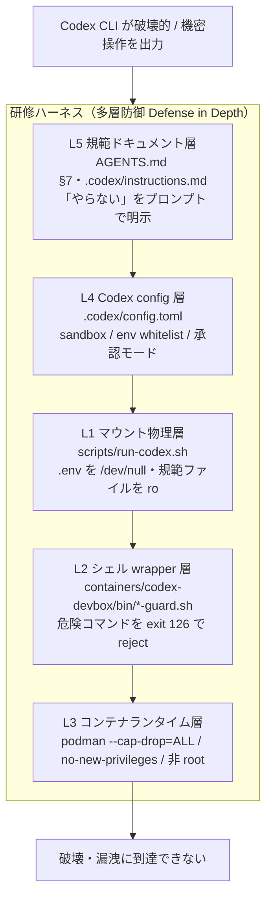
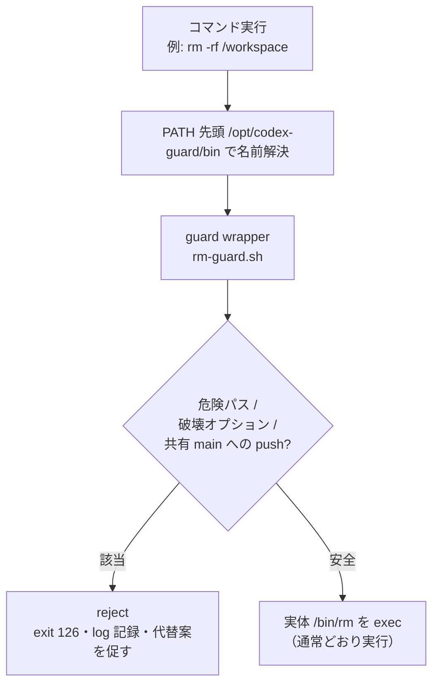
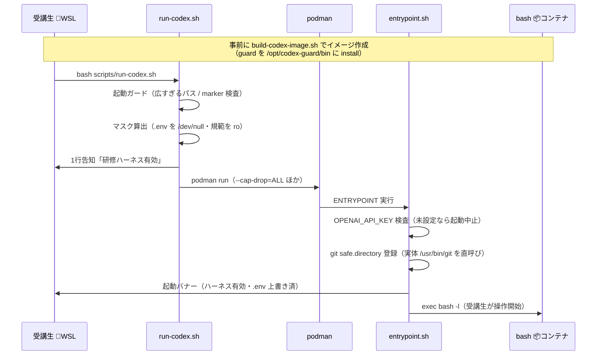

# エージェントハーネス（Codex Guard）解説 — 講師用

> 本書は **講師向け**。受講生が Codex CLI と協働する研修環境に組み込まれた「研修ハーネス（Codex Guard）」について、**なぜ必要か（目的・設計思想）** と **どう動くか（実装）**、そして **どう確認しトラブルにどう対応するか（運用ガイド）** を一望できるようにまとめたもの。
>
> 受講生向けの操作手順は [education/TROUBLESHOOTING.md](../education/TROUBLESHOOTING.md)、Codex 自身が従う規範は [AGENTS.md §7](../AGENTS.md) を参照。本書はその「裏側の仕組み」を講師が説明できるようにする副読本。

## 0. このドキュメントについて

### 0-1. 対象読者と前提知識

- **対象**: 研修を運営する講師。受講生からの「なぜ止まったのか」に答えられるようにする。
- **前提**: Git / コンテナ（Podman）/ Linux シェルの存在を知っていれば十分。シェルスクリプトの細部は読めなくてよい（「どの層が何を止めるか」を説明できれば足りる）。
- **実装の詳細**を追いたい場合は、本書が示すファイルパスと行番号から実ファイルを直接読むこと。**実ファイルが唯一の正**。

### 0-2. 扱う範囲 / 扱わないこと

| 扱う | 扱わない |
|---|---|
| ハーネスの目的・設計思想 | Codex CLI 本体の動作仕様（公式ドキュメント参照） |
| 5 層それぞれの実装と守備範囲 | Spring Boot 演習の中身（[EXERCISES.md](../EXERCISES.md) 参照） |
| 有効性の確認・トラブル対応・切替ポイント | guard スクリプトの 1 行ずつの解説（実ファイル参照） |

### 0-3. 凡例（本書および研修共通）

- 🪟 Windows PowerShell
- 🐧 WSL Ubuntu ターミナル（プロンプト末尾 `~$`）
- 📦 Codex devbox コンテナ内（`codex-shell` で入った状態、プロンプト末尾 `:/workspace$`）
- 🌐 ブラウザ

### 0-4. 関連ドキュメント

| 目的 | ドキュメント |
|---|---|
| Codex が従う禁止コマンド規範 | [AGENTS.md §7](../AGENTS.md) |
| Codex 補足（触ってよいパス表） | [.codex/instructions.md](../.codex/instructions.md) |
| 受講生: ブロックされた時の対処 | [education/TROUBLESHOOTING.md Q4-2 / Q4-3](../education/TROUBLESHOOTING.md) |
| 講師: 当日の即応判断 | [instructor/faq.md](./faq.md) |

---

## 1. ハーネスの目的と設計思想

### 1-1. 何を守るのか

研修では受講生が Codex CLI を **自走（`approval_policy = "on-failure"`）** させて開発する。守りたいものは 4 つ。

1. **学習の場** — Codex が暴走して環境を壊すと、受講生は本題（TDD と設計）ではなく復旧に時間を奪われる。
2. **受講生の機密** — `OPENAI_API_KEY` や DB パスワード（`.env`）が Codex のコンテキストやログに漏れない。
3. **研修の進行** — 1 人のトラブルが全体を止めない。物理的に「起き得ない」状態にしておく。
4. **共有 main** — 本研修は全受講生が同じ共有リポを使うため、誰かが共有 `main` を汚すと全員に波及する。Codex が `main` へ push しようとするのを止める（[instructor-setup-guide.md §4](./instructor-setup-guide.md) の共有 main 保護 4 層の一翼。Codex Guard はそのうちコンテナ内 Codex の経路を担う）。

### 1-2. 想定リスク

Codex は確率モデルである以上、次のいずれでも破壊的操作を出力しうる。

- **プロンプトインジェクション** — 受講生やファイル内の文言に誘導される
- **モデルの誤動作** — 文脈を誤読して `rm -rf` や `git reset --hard` を提案する
- **教材ミス** — 曖昧な指示が危険操作を誘発する

### 1-3. 設計原則 — 「指示を守らせる」ではなく「物理的に走らせない」

ハーネスの中核思想は次の 2 点。

- **指示（プロンプト）だけに頼らない**。「やらないで」と書くのは最終層であって第一防衛線ではない。上記リスクのどれでも突破されうるため、**コンテナとシェルの層で破壊操作そのものが走らない**状態を作る。
- **blocklist 方式**（明らかな破壊だけ拒否）を採る。allowlist（許可コマンドの列挙）にすると通常の開発（`./mvnw verify`、`git commit`、`rm -r target/`）まで止まり、サポートコストが爆発する。**「`rm file` は通し、`rm -rf /` だけ止める」** 粒度設計が肝。

> 💡 だからこそ「ハーネスを外せばラク」ではない。ハーネスは受講生の自由を奪うのではなく、**通常の開発フローはそのまま通し、研修に不要な破壊操作だけを止める**。標準的な開発で困ることはまず無い（→ §3-3）。

### 1-4. 多層防御の全体像

5 つの層が**それぞれ独立して**効く。どれか 1 層が破られても、別の層が受け止める。



> 🖼️ **画像版（Mermaid 非対応ビューアで図が出ない場合はこちら）**: [多層防御の全体像 PNG](images/codex-guard/01-defense-in-depth.png)

| 層 | 実装ファイル | この層が単独で防ぐ代表例 |
|---|---|---|
| L5 規範 | `AGENTS.md` / `.codex/instructions.md` | Codex が禁止コマンドを「そもそも出力しない」 |
| L4 config | `.codex/config.toml` | 機密 env を Codex に渡さない / 書き込み範囲を制限 |
| L1 マウント | `scripts/run-codex.sh` | `.env` を読まれても空・規範ファイルを書き換えられない |
| L2 wrapper | `containers/codex-devbox/bin/*-guard.sh` | `rm -rf /` 等を実行直前に拒否 |
| L3 ランタイム | `scripts/run-codex.sh` の podman オプション | 権限昇格・capability 悪用・コンテナ外（システム / ホーム / ホスト権限）への波及を断つ |

---

## 2. 実装解説（層ごと）

### 2-1. L1 マウント物理層 — `scripts/run-codex.sh`

受講生は 🐧 WSL で `bash scripts/run-codex.sh`（別名 `codex-shell`）を実行してコンテナに入る。このラッパが**起動時に物理的なガードを組み立てる**。

**(a) 起動ガード**（`run-codex.sh:43-60`）
`/`・`~`・`/home`・`/mnt/c`・`/workspace` など「広すぎるパス」を `/workspace` にマウントしようとすると起動拒否。さらに `REQUIRED_MARKERS`（`pom.xml` / `AGENTS.md` / `.codex/config.toml`）が無いディレクトリも拒否し、**tsubuyaki-board のリポルート以外では起動しない**。

**(b) 機密ファイルの `/dev/null` 上書きマウント**

- 常時マスク（`:101-110`）: コンテナ内の `/home/codex/.bashrc` / `.bash_history` / `.profile` / `.gitconfig` を `/dev/null` に bind（`ro=true`）。
- 条件付きマスク（`:113-125`）: ホスト側 `/workspace` 配下を `find` し、`.env` / `.env.*` / `*secret*`・`*Secret*` / `*credentials*`・`*Credentials*` / `*.pem` / `*id_rsa*` / `*id_ed25519*`（大文字小文字の両バリアントを個別に列挙）に**一致したファイルだけ** `/dev/null` で上書き（`.git` / `target` / `.codex/sessions` は探索除外）。

> 💡 効果: Codex が `cat .env` しても**空が返る**。`OPENAI_API_KEY` や DB パスワードがコンテキストに載らない。ホストに `.env` が無い初期状態では「漏れる値が無い」ので、マスクしないこと自体が安全（だから条件付き）。

**(c) 規範ファイルの読み取り専用化**（`:130-140`）
`AGENTS.md` / `.codex` / `instructor` / `.github` を `:ro` で再マウント。**Codex はこれらを読めても書き換えられない**（規範そのものの改ざんを防ぐ）。

### 2-2. L2 シェル wrapper 層 — `containers/codex-devbox/bin/*-guard.sh`

#### 仕組み: PATH 先頭挿入

guard 本体は `/opt/codex-guard/bin/` に置かれ、`rm` / `git` / `chmod` / `chown` / `dd` / `sudo` という**コマンド名の symlink** が張られる（`install-guards.sh:29-34`）。この `/opt/codex-guard/bin` を **PATH の先頭**に入れることで、`rm` と打つと実体 `/bin/rm` ではなく `rm-guard.sh` が先に呼ばれる。

PATH 先頭挿入は **3 系統**で固める（`install-guards.sh:37-68`）。シェルの起動経路を取りこぼさないため。

| 仕込み先 | カバーする経路 |
|---|---|
| `/etc/profile.d/codex-guard.sh` | ログインシェル（`bash -l`） |
| `/etc/bash.bashrc` | 非ログインの `bash -c "..."` 経由 |
| `/etc/environment` | bash 以外（`sh` / `dash`）や exec 系 |

加えて `Containerfile:87` で `ENV PATH=/opt/codex-guard/bin:...` を設定し、イメージ既定の PATH 自体も guard 先頭にしてある。

> 💡 **実装の正確な注意点**: guard は実体バイナリ（`/bin/rm` 等）を**無効化していない**（パーミッションは `0755` のまま）。当初は実体を実行不能にする案だったが、それでは guard wrapper 自身が実体を `exec` できなくなる（`install-guards.sh:70-77` にこの判断が記録されている）。したがって防御は **「PATH 先頭で素のコマンド名解決を必ず guard 経由にする」** 戦略で成り立つ。この帰結が §2-7 の「絶対パス直呼びは wrapper を通らない」という既知の制約につながる。

#### guard の共通動作 — `guard-common.sh`

- 拒否時は **exit code 126**（`:11`）で、`[codex-guard]` 始まりのメッセージを stderr に出す。
- 拒否は `/tmp/codex-guard.log` に `日時 REJECTED <cmd> :: <理由> :: argv=...` の形式で記録（`:19-21`）。
- `guard_contains_dangerous_path`（`:51-72`）が「危険パス」を判定: `/` 系システムパス、`~` / `~/.codex` / `~/.m2`、`.` / `..`、`/workspace/.codex` / `/workspace/.github` / `/workspace/AGENTS.md` / `/workspace/.git`。

#### 各 guard の守備範囲



> 🖼️ **画像版（Mermaid 非対応ビューアで図が出ない場合はこちら）**: [guard wrapper の判定フロー PNG](images/codex-guard/02-guard-flow.png)

| guard | 拒否する操作 | 通す操作（研修で正常に使う） |
|---|---|---|
| `rm-guard.sh` | `rm -rf /` `~` `.` `..` / システム・機密・規範パス削除 / 許可外ディレクトリの再帰削除 | `rm <file>`、`rm -r` は `target/` `build/` `node_modules/` `.cache/` `tmp/` `out/` `logs/` のみ許可 |
| `git-guard.sh` | `push --force/-f/--force-with-lease`・**`push` の宛先が `main`（共有 main 保護）**・`rm -r`・`clean -f系`・`reset --hard`・`checkout -- .`・`restore .`・`config --global/--system`・`filter-branch`・`update-ref --delete` | `add` `commit` `自分のブランチへの通常 push` `rm <file>`（単発）`restore <file>`（単発）`stash` `status` `log` `diff` |
| `chmod-guard.sh` | `chmod -R 777`、システム・機密・規範パスへの適用 | `chmod +x script.sh`、通常の `644` など |
| `chown-guard.sh` | システム・機密パスへの所有者変更 | ローカルファイルの通常変更 |
| `dd-guard.sh` | **一律拒否**（研修に正当用途なし） | — |
| `sudo-guard.sh` | **一律拒否**（昇格による全 guard 迂回を断つ） | — |

> 💡 `git-guard` は `-C /workspace` のような前置オプションを読み飛ばしてから本当のサブコマンドを特定する（`git-guard.sh:31-65`）。`git -C ... reset --hard` のような迂回も捕捉する作り。

### 2-3. L3 コンテナランタイム層 — `run-codex.sh:73-88`

podman 起動オプションでホストへの波及と権限昇格を断つ。

| オプション | 効果 |
|---|---|
| `--cap-drop=ALL` | Linux capability を全削除。root 相当の特権操作（マウント等）を封じる |
| `--security-opt no-new-privileges` | sudo を持ち込んでも setuid 系で権限昇格できない |
| `--userns=keep-id` | ホスト uid=1000 とコンテナ uid=1000 を一致させ、bind マウントの権限事故を防ぐ |
| `--security-opt label=disable` | WSL / SELinux 環境での起動阻害を回避 |
| `--rm` | 終了時にコンテナを破棄（汚染を残さない） |

環境変数は `OPENAI_API_KEY` / `TZ` / `LANG`（＋設定時のみ `SPRING_PROFILES_ACTIVE`）だけを透過。**ホスト側の他の env はコンテナに渡らない**。

### 2-4. L4 Codex config 層 — `.codex/config.toml`

Codex CLI に渡す設定で「Codex 自身に課す約束事」と「渡す情報の最小化」を担う。

| 設定 | 値 | 意味 |
|---|---|---|
| `approval_policy` | `on-failure` | 通常自走、失敗時のみ受講生に確認（§3-4 で `on-request` に切替可） |
| `sandbox_mode` | `workspace-write` | `/workspace` と Maven キャッシュのみ書き込み可、他は read-only |
| `disable_response_storage` | `true` | 研修初期は応答保存を抑制 |
| `[shell_environment_policy].include_only` | `JAVA_HOME` / `MAVEN_OPTS` / `TZ` / `LANG` / `SPRING_PROFILES_ACTIVE` | **これ以外の env は Codex に渡さない**。`ORACLE_PWD` / `AWS_*` / `GH_TOKEN` 等は意図的に除外 |
| `[sandbox_workspace_write].writable_roots` | `/workspace`、`/home/codex/.m2` | 書き込み可能ルートを限定 |
| `[network].allow` | Maven / GitHub / `api.openai.com` のみ | 想定外の通信先を絞る |
| `[tools].web_search` | `false` | 研修中の脱線防止（応用課題で `true` に切替可） |

加えて `instructions`（`config.toml:33-73`）に研修ハーネスの禁止リストを記載し、**プロンプト層からも**同じ禁止を Codex に伝える。

> 💡 `config.toml:10-12` 自身が「これはプロンプト層であり、最終的な物理ブロックはコンテナの研修ハーネスで別途行われる。多層防御の最内殻」と明記している。config は約束事、物理ブロックは L1/L2/L3 という役割分担。

### 2-5. L5 規範ドキュメント層 — `AGENTS.md §7` / `.codex/instructions.md`

人間にも Codex にも読める形で禁止と許可を明文化する最終層。

- **`AGENTS.md §7.3`** が禁止コマンドを 5 系統に分けて列挙: §7.3.1 機密読み取り / §7.3.2 破壊的ファイル操作 / §7.3.3 履歴・権限改ざん＋**guard 迂回禁止**（絶対パス直呼び・`bash -c`・`eval`）/ §7.3.4 権限昇格・任意コード実行 / §7.3.5 DB 破壊。
- **`AGENTS.md §7.4`** が許可粒度を明示: `git rm <file>` は**単発のみ**（再帰不可）、`git restore <file>` も**単発のみ**。
- **`AGENTS.md §7.5`** が「ブロックされた時の Codex の振る舞い」を規定: ①再試行しない ②代替手段を提案する ③受講生に確認する ④強行突破しない。
- **`.codex/instructions.md`** が「触ってよいパス」を **読み取り / 書き込み / 削除の 3 列**＋凡例（✅ 自由 / 🟡 受講生確認 / 🛑 物理ブロック）で一覧化。

### 2-6. 起動の流れ（ビルド → 起動 → バナー）



> 🖼️ **画像版（Mermaid 非対応ビューアで図が出ない場合はこちら）**: [起動シーケンス PNG](images/codex-guard/03-startup-sequence.png)

ビルド時・起動時には guard を**意図的にバイパスする正規操作**が 2 か所ある。いずれも「Codex が走り出す前」のセットアップで、絶対パスを使う。

- `Containerfile:89-95`: `/bin/chmod +x entrypoint.sh`（PATH 先頭の guard を避けるため絶対パス）。
- `entrypoint.sh:27-32`: `/usr/bin/git config --global safe.directory`（guard が `config --global` を拒否するため実体直呼び）。

> 💡 これは「ハーネスを仕込む過程でハーネス自身に引っかからない」ための回避であり、**Codex に許された穴ではない**。Codex が同じ絶対パス迂回をすることは `AGENTS.md §7.3.3` で明示的に禁止されている。

### 2-7. 既知の制約と最終防衛線

正直に共有すべき限界。**どの層も単独では完璧ではなく、層の重なりで担保している**。

- **絶対パス直呼び**（`/bin/rm -rf /workspace`）と **`bash -c "rm -rf /"`** は、コマンド名解決を経ないため **L2 wrapper を通らない**（理屈上は素通りしうる）。
- これらは **L5（規範で明示禁止）** と **L4（プロンプトでも禁止）** で抑止する。万一すり抜けても被害は L1/L3 で限定される: `.env` 等の機密は既に空（L1）、システム全体・ホスト権限・ホーム配下への波及は capability 剥奪・非 root・`/dev/null` マスクで阻まれ（L1/L3）、コンテナ自体の汚染は `--rm` で残らない（L3）。
- ただし **`/workspace` 配下のデータ消失は防げない**。`/workspace` はホスト（WSL）の作業ディレクトリの bind マウント（`run-codex.sh:84` の `-v ...:/workspace:rw`）であり、絶対パス直呼びの `/bin/rm -rf /workspace` が wrapper を抜けて実行されれば**ホスト側の実ファイルが消える**（コンテナを作り直しても戻らない）。だからこそ L5/L4 のプロンプト層での禁止と、受講生のこまめな commit / push が最後の保険になる。

---

## 3. 運用ガイド（講師向け）

### 3-1. ハーネス有効性の確認

**(a) 起動バナーを見る**（最も簡単）
受講生が `codex-shell` でコンテナに入ると、`entrypoint.sh:39-63` のバナーが出る。次の 2 行を確認する。

```
  研修ハーネス : 有効 (rm / git / chmod / chown / dd / sudo を wrapper で監査)
  .env         : /dev/null 上書きマウント済 (機密値は到達不能)
```

「研修ハーネス: 無効」と出る場合はイメージが guard 入りでない（古い）。`bash scripts/build-codex-image.sh` でビルドし直す。

**(b) 実際に弾かれることを確認**（📦 コンテナ内）

```bash
rm -rf /etc              # → [codex-guard] ... exit 126 で止まれば正常（万一通ってもコンテナ内のみ・--rm で破棄）
cat .env                 # → 何も出ない（空）なら正常
./mvnw -B -Ph2 verify    # → 通常どおり完走すれば「誤検知なし」も確認できる
```

> ⚠️ 確認用の実弾に `rm -rf /workspace` は使わないこと。`/workspace` はホストの bind 実体なので、万一ハーネスが無効なイメージだと受講生のプロジェクトごと消える。システムパス（`/etc` 等）なら guard が止め、万一すり抜けてもコンテナ内に閉じて `--rm` で破棄される。

> 💡 3 つ目が重要。「危険操作は止まる」だけでなく「**通常の開発は止まらない**」ことまで確認して初めて、ハーネスが正しく機能していると言える。

### 3-2. `[codex-guard]` で止まった時のトラブル対応フロー

受講生から「Codex が止まった」と相談されたら、次の順で対応する。受講生向けの同内容は [TROUBLESHOOTING.md Q4-2](../education/TROUBLESHOOTING.md) にある。

1. **再試行させない**。同じコマンドは何度やっても同じ結果（これは異常ではなく設計どおり）。
2. **Codex に「代替案を出して」と返させる**。`git reset --hard` → `git stash push -u`、`git clean -fd` → 個別 `rm <file>` など、`AGENTS.md §7.5` の代替が返るはず。
3. **本当に必要なら受講生本人が 📦 を抜けて 🐧 WSL 側で実行**する（例: `target/` の一括削除）。Codex に強行させない。
4. **ログを見る**: 📦 コンテナ内 `/tmp/codex-guard.log` に `REJECTED <cmd> :: <理由> :: argv=...` が残る。同じ拒否が頻発するなら、プロンプト設計を見直すサイン。

> 💡 `.env` の中身を Codex が答えない、というのは故障ではなく仕様（§2-1(b)・[TROUBLESHOOTING.md Q4-3](../education/TROUBLESHOOTING.md)）。API キー / DB パスワードの操作は受講生が 🐧 WSL 側で `.env` を直接編集する。

### 3-3. 受講生への説明のコツ

- **「制限」ではなく「レール」と言い換える**。ハーネスは自由を奪うのではなく、研修に不要な事故だけを止める。通常の TDD・コミット・ビルドはそのまま通る。
- **「なぜ止まったか」を一言で**: 「それは研修中に使わない破壊操作で、Codex のためのガードレールが働いた」。
- **代替を一緒に考える**: 止まったコマンドの 9 割は「そもそも不要」か「受講生が手で安全にやるべき」もの。[TROUBLESHOOTING.md の Git 操作の安全ガイド](../education/TROUBLESHOOTING.md#git-操作の安全ガイド)に早見表がある。

### 3-4. 切替ポイント（運用判断）

研修の回や受講生のレベルに応じて、講師が調整できる箇所。いずれも `.codex/config.toml` を編集し、講師が共有リポの `main` に反映する運用（受講生のブランチには影響しない）。

| 設定 | 既定 | 切替の意図 |
|---|---|---|
| `approval_policy` | `on-failure` | 安全最優先の回は `on-request`（毎コマンド確認）にする |
| `[tools].web_search` | `false` | 仕上げ・応用課題で外部調査を許す場合のみ `true` |
| `disable_response_storage` | `true` | 評価・再現性のため保存したい場合のみ `false`（受講生に説明の上で） |

> 💡 **L1/L2/L3 の物理ガード（マウント・wrapper・capability）は研修中に外さない**。切替えてよいのは L4 の運用パラメータまで。物理層を外すと多層防御の前提が崩れる。

---

## 4. まとめ — 講師が押さえる 3 点

1. **目的**: Codex の自走を活かしつつ、破壊・機密漏洩・進行停止を「指示」ではなく「物理」で防ぐ。
2. **仕組み**: L5 規範 → L4 config → L1 マウント → L2 wrapper → L3 ランタイムの 5 層。どれか 1 層が破られても他で止まる。
3. **運用**: 起動バナーで有効性を確認し、`[codex-guard]` で止まったら「再試行させず代替へ」。物理層は外さず、調整は L4 パラメータまで。

---

> **本書の検証について**: 本書のファイル参照・行番号・コマンド例は実装ファイル（`scripts/run-codex.sh` / `containers/codex-devbox/bin/*-guard.sh` / `containers/codex-devbox/Containerfile` / `containers/codex-devbox/entrypoint.sh` / `.codex/config.toml` / `AGENTS.md` / `.codex/instructions.md`）を直接読んで記述した。実装が更新された場合は実ファイルを正とし、本書を追従させること。Mermaid 図は GitHub 上でレンダリングされる。
